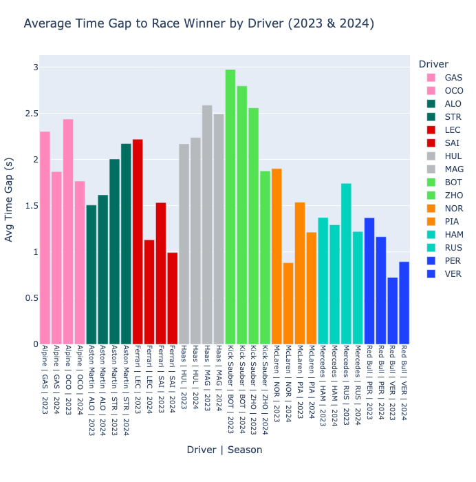

# 🏎️ F1 Driver Time Gap Analysis (2023–2024)

This Python project analyzes Formula 1 driver performance across the 2023 and 2024 seasons using real-world data fetched from the [FastF1](https://theoehrly.github.io/Fast-F1/) API. It summarizes driver standings, total points, and year-over-year trends — and visualizes the results with interactive Plotly charts.

Designed for data analysts looking to demonstrate skills in data ingestion, transformation, and visualization with clean, modular Python scripts.

Made by Jaden Ji Miguel, July 2025

---

## 📦 Features

- ✅ Live data from [FastF1](https://theoehrly.github.io/Fast-F1/) (no manual downloads)
- ⏱️ Calculates average time gaps to the race winner
- 🧩 Automatically maps driver names and teams
- 📊 Compares seasons 2023 vs 2024
- 📈 Interactive Plotly bar chart
- 🧹 Modular, clean codebase (no notebooks)

---

## 📁 Project Structure

```

f1-performance-23-24/
├── data/
│   ├── driver_time_gaps.csv     ← Per-race time gaps (from FastF1)
│   └── avg_time_gaps.csv        ← Aggregated average gaps per driver/season
├── src/
│   ├── data_fetch.py            ← Pulls and caches live data via FastF1
│   ├── data_processing.py       ← Cleans and aggregates time gap data
│   ├── analysis.py              ← Further summary/statistical analysis
│   └── visualization.py         ← Builds interactive visualizations
├── assets/
│   └── example_output.png       ← Chart screenshot
├── requirements.txt             ← Python dependencies
└── README.md                    ← Project overview

````

---

## 🚀 Getting Started

### 1. Clone and Set Up

```bash
git clone git@github.com:jaden-miguel/f1-performance-23-24.git
cd f1-performance-23-24
python3 -m venv venv
source venv/bin/activate
pip install -r requirements.txt
````

---

### 2. Fetch and Process Live Race Data

```bash
python src/data_fetch.py
python src/data_processing.py
python src/analysis.py
```

This will generate:

```
data/driver_time_gaps.csv
data/avg_time_gaps.csv
```

---

### 3. Visualize with Plotly

```bash
python src/visualization.py
```

✅ Opens an interactive bar chart comparing each driver’s average time gap to the race winner — side by side by team and season.

---

## 📷 Example Output



---

## 🔧 Dependencies

Install everything with:

```bash
pip install -r requirements.txt
```

Key packages:

* [`fastf1`](https://pypi.org/project/fastf1/)
* `pandas`
* `plotly`

---

## 🧠 What You’ll Learn

* How to use `FastF1` for live F1 telemetry and result data
* Time gap analysis based on raw lap timing
* Season-to-season performance comparison
* Interactive storytelling with Plotly
* Clean code and folder structure

---

## 📚 Data Source

* [FastF1](https://theoehrly.github.io/Fast-F1/) — A Python API wrapper for live Formula 1 timing and telemetry
* Pulls official Formula1.com session data

---

## 💼 Why This Project?

This project demonstrates:

* 🔁 End-to-end data pipeline (from live API → analysis → visualization)
* 💡 Insight-driven design (focus on real driver gaps, not just points)
* 🧠 Data storytelling and technical fluency

---

## 🪪 License

MIT License — feel free to use or extend for your own racing or data projects.

---

## 🙌 Connect

If this project helped you, feel free to star ⭐ it or connect with me on GitHub!